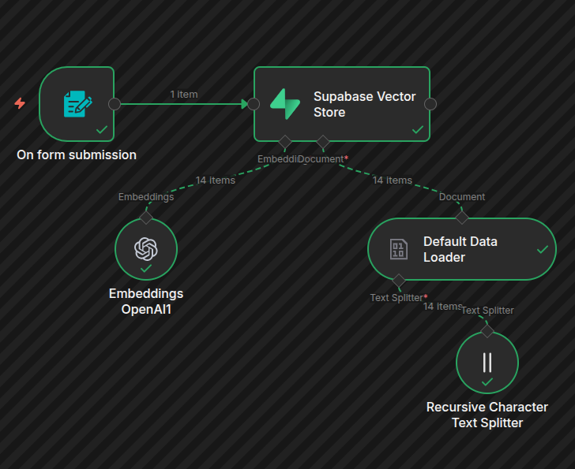
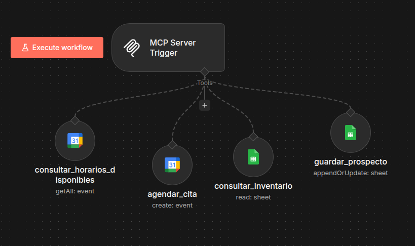

# VoiceAgent

Agente de voz basado en LiveKit Agents + OpenAI + Deepgram + Cartesia, con base de conocimiento en Supabase.

---

## Requisitos

- Python 3.10+
- Cuenta en [LiveKit Cloud](https://cloud.livekit.io)
- Instalar el CLI de Livekit Cloud (https://docs.livekit.io/intro/basics/cli/start/) 
- Cuenta en [Twilio](https://twilio.com) (para llamadas SIP)
- Cuenta en [N8N](https://n8n.io/)
- Cuenta en [Supabase](https://supabase.com/)
- API Keys: OpenAI, Deepgram, Cartesia, Supabase, Eleven Labs(Si tienes)
- Tener un sheet de google al cual anotar los prospectos/inventario

---

## Instalación

```bash
git clone https://github.com/Dazaur-eDev/AgenteVoz.git
cd VoiceAgent
pip install .
```

O si usas `uv` (recomendado):

```bash
uv sync
```

---

## Configuración

Crea el archivo `.env.local` en la raíz del proyecto:

```env
# LiveKit
LIVEKIT_URL=wss://tu-proyecto.livekit.cloud
LIVEKIT_API_KEY=tu_api_key
LIVEKIT_API_SECRET=tu_api_secret

# OpenAI
OPENAI_API_KEY=sk-...

# Deepgram (STT)
DEEPGRAM_API_KEY=...

# Cartesia (TTS)
CARTESIA_API_KEY=...

# Supabase (base de conocimiento)
SUPABASE_URL=https://xxxx.supabase.co
SUPABASE_KEY=tu_service_role_key
SUPABASE_TABLE=documents

# Embeddings
EMBEDDING_MODEL=text-embedding-3-large
EMBEDDING_DIMENSIONS=1536
K_TOP=3

# MCP (opcional)
MCP_SERVER=https://tu-mcp-server.com
MCP_TOKEN=tu_token
MCP_TIMEOUT=10
MCP_SESSION_TIMEOUT=30

# Transferencia de llamadas (número destino en formato E.164)
TRANSFER_TO=+56XXXXXXXXX

# Dirección del system_prompt.txt
AGENT_PROMPT_FILE=/direccion/system/prompt/
```

---

## Supabase – Base de Conocimiento

Para la creación de la tabla en Supabase, guiarse por:
https://supabase.com/docs/guides/ai/langchain?database-method=sql&queryGroups=database-method

Usa este codigo en el sql editor de supabase
```sql
-- Enable the pgvector extension to work with embedding vectors
create extension vector
with
  schema extensions;

-- Create a table to store your documents
create table documents (
  id bigserial primary key,
  content text, -- corresponds to Document.pageContent
  metadata jsonb, -- corresponds to Document.metadata
  embedding extensions.vector(1536) -- 1536 works for OpenAI embeddings, change if needed
);

-- Create a function to search for documents
create function match_documents (
  query_embedding extensions.vector(1536),
  match_count int default null,
  filter jsonb DEFAULT '{}'
) returns table (
  id bigint,
  content text,
  metadata jsonb,
  similarity float
)
language plpgsql
as $$
#variable_conflict use_column
begin
  return query
  select
    id,
    content,
    metadata,
    1 - (documents.embedding <=> query_embedding) as similarity
  from documents
  where metadata @> filter
  order by documents.embedding <=> query_embedding
  limit match_count;
end;
$$;
```
Luego, para hacer la inserción de la información de algun pdf es necesario usar el siguiente flujo en n8n:



Nota: considerar: query_embedding vector(1536)

Este flujo se ejecuta manualmente cuando necesitas actualizar el conocimiento del agente.

```
Formulario Web (/upload/document)
        ↓
Default Data Loader        → extrae texto del PDF
        ↓
Recursive Character        → divide en chunks de 500 caracteres
Text Splitter
        ↓
Embeddings OpenAI          → vectoriza con text-embedding-3-large (1536 dims)
        ↓
Supabase Vector Store      → inserta chunks + embeddings en tabla "documents"
```

> Requiere credenciales: **OpenAI API Key** y **Supabase API Key** y una tabla creada llamada documents.

---

## MCP Server
El servidor MCP es levantando mediante los flujos de n8n:



Servidor MCP expone 4 herramientas al agente de voz vía HTTP con autenticación por header. Se activa cada vez que el agente llama a una herramienta durante una conversación.

| Herramienta | Acción | Servicio |
|---|---|---|
| `consultar_horarios_disponibles` | Lista eventos en un rango de fechas para ver disponibilidad | Google Calendar |
| `agendar_cita` | Crea un evento con los datos de la reunión | Google Calendar |
| `consultar_inventario` | Lee la hoja "Inventario" con los vehículos disponibles | Google Sheets |
| `guardar_prospecto` | Guarda o actualiza cliente en hoja "Prospecto" (clave: teléfono) | Google Sheets |

> Requiere credenciales: **Google Calendar OAuth2** y **Google Sheets OAuth2**.


## Twilio configuraciones:

- Obtener el SIP Endpoint de LiveKit (nombre.sip.livekit.cloud)
- Comprar un número de teléfono
- Crear un Elastic SIP Trunk
  - Originations: agrega una nueva "Origination URI" 
  - Asociar el número telefónico al Trunk

## LiveKit – Trunk SIP y Dispatch Rule

### 1. Trunk SIP entrante (Twilio)
Crear un archivo inbound-trunk.json:

```bash
{
  "trunk": {
      "name": "Trunk twilio",
      "numbers": ["+15139957074"], # Tu numero de twilio
      "krispEnabled": true
  }
}
```
Ejecuta en la terminal para verificar que el inbound trunk exista
```
lk sip inbound list
```


### 2. Dispatch Rule

Crear un archivo dispatch-rule.json :
```bash
{
  "dispatch_rule": {
    "rule": {
      "dispatchRuleIndividual": {
        "roomPrefix": "call-"
      }
    },
    "trunkIds": ["tusiptrunkid"],
    "name": "Nombre",
    "roomConfig": {
      "agents": [
        {
          "agentName": "nombredetuagente"
        }
      ]
    }
  }
}

```
Ejecuta en la terminal para verificar que el dispatch rule exista
```
lk sip dispatch list
```

El `agentName` en el dispatch debe coincidir con el definido en `WorkerOptions`.

---

## Ejecución

```bash
uv run agent_icm.py dev   
```

Puedes usar https://agents-playground.livekit.io/ para probar el funcionamiento del flujo MCP, la base de conocimiento y las conversaciion con el LLM

---

## Pruebas

| Función | Herramienta | Funciona en Livekit-Playground |
|---|---|--------------------------------|
| Conversación / STT / TTS | Todas | Sí                             |
| Base de conocimiento | `buscar_en_base_de_conocimiento` | Sí                             |
| Herramientas MCP | Varias | Sí                             |
| Transferencia de llamada | `transfer_call` | Solo llamada SIP real          |
| Colgar llamada | `end_call` | Solo llamada SIP real          |

Para probar `transfer_call` y `end_call`, llama al número del trunk SIP desde un teléfono real.

---

## Estructura del Proyecto

```
VoiceAgent/
├── agent.py           # Código principal del agente
├── pyproject.toml     # Dependencias del proyecto
├── .env.local         # Variables de entorno 
├── prompts/
│   └── gabriela.txt   # System prompt
├── assets/            # Recursos visuales del readme
│   ├── MCPServer_flow_n8n.png
│   └── Supabase_flow_n8n  
├── dispatch-rule.json # Reglas a crear para Livekit
├── inbound_trunk.json # SIP trunk de twilio
└── README.md
```